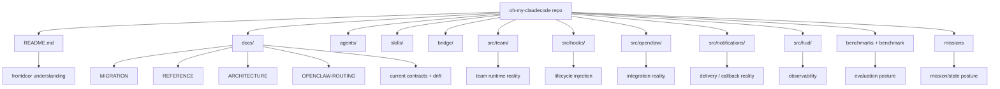

# oh-my-claudecode(OMC) 학습 가이드

**원본 repo의 README·주요 docs·핵심 source tree를 함께 읽고, OMC를 ‘기능 많은 플러그인’이 아니라 ‘Claude Code 운영 런타임’으로 이해하게 만드는 가이드**

---

## 먼저 판단부터

이전 가이드는 틀린 말만 한 건 아니었지만, **원본 repo의 폭과 현재 구조를 충분히 담지 못했다.**

특히 부족했던 점은 네 가지였다.

1. **frontdoor가 너무 빨리 추상화로 올라갔다**
   - Team, OpenClaw, hooks 쪽 해석은 있었지만
   - 원본 repo 자체가 얼마나 넓은 프로젝트인지가 초반에 안 보였다.

2. **upstream drift를 더 전면에 드러냈어야 했다**
   - 예: README의 `32 specialized agents` vs `docs/ARCHITECTURE.md`의 `19 specialized agents`
   - 예: README는 Team/CLI-first runtime을 강하게 말하고, migration은 legacy MCP runtime deprecation을 더 분명히 말한다.

3. **학습자/운영자/기여자 관점 분기가 약했다**
   - 실제 원본은 단순 사용법만 있는 repo가 아니라
   - docs, agents, skills, bridge, src, benchmark, missions까지 가진 복합 저장소다.

4. **Obsidian live target 처리 절차를 잘못했다**
   - repo-local pack은 괜찮았지만
   - live vault 대상은 확인 없이 쓰면 안 됐다.

즉, 이번 개정판은 단순 보강이 아니라 **가이드의 기준선 자체를 다시 올리는 작업**이다.

---

## 이 가이드는 무엇을 답해야 하나

좋은 OMC 가이드는 최소한 아래를 빠르게 답해야 한다.

1. **OMC는 정확히 무엇인가**
2. **지금 기준의 중심 표면은 무엇인가**
3. **원본 repo를 어디부터 읽어야 하나**
4. **어디에서 문서/구현/운영 드리프트가 생기고 있나**
5. **사용자 / 운영자 / 기여자가 각각 무엇을 먼저 봐야 하나**

---

## 한 줄 정의

**OMC는 Claude Code 위에 Team orchestration, persistent execution, tmux CLI workers, hooks/state, HUD, notifications, OpenClaw routing, skill/agent 체계를 얹은 운영 런타임이다.**

이 설명에서 중요한 건 `런타임`이다.

OMC를 README의 멋진 키워드 몇 개로만 보면:
- 자동화 도구처럼 보이고
- slash command 모음처럼 보이고
- 프롬프트 세트처럼 보인다.

하지만 원본 repo를 실제로 보면 중심은 이쪽이다.

- **행동을 어떤 규칙으로 주입하는가** (`skills/`, hooks)
- **누가 어떤 역할로 일하는가** (`agents/`)
- **실행을 어떤 상태로 추적하는가** (`.omc/`, sessions, artifacts, replay)
- **실제 worker를 어떤 표면으로 운영하는가** (`omc team`, tmux runtime)
- **외부 시스템으로 어떻게 라우팅하는가** (`src/openclaw/`, notifications)

---

## 원본 repo를 실제로 보면 무엇이 있나

### top-level에서 바로 보이는 것

원본 `oh-my-claudecode` 저장소를 기준으로, 초반부터 눈에 띄는 축은 이렇다.

| 경로 | 이게 말해주는 것 |
|---|---|
| `README.md` | 현재 frontdoor 메시지와 Quick Start |
| `docs/` | migration, architecture, reference, compatibility, performance 문서층 |
| `agents/` | 역할별 에이전트 프롬프트 원형 |
| `skills/` | 사용자 체감 workflow surface |
| `bridge/` | CLI/runtime 진입점 |
| `src/team/` | Team runtime 핵심 |
| `src/hooks/` | lifecycle injection / persistent behavior |
| `src/openclaw/` | OpenClaw integration public API + signal builder |
| `src/notifications/` | 외부 채널/콜백/알림 계층 |
| `src/hud/` | HUD / mission board / observability |
| `benchmarks/`, `benchmark/` | 성능/품질 평가를 실제 artifact로 다루는 repo 성격 |
| `missions/` | 실제 작업 단위와 운영 흔적이 남는 성격 |
| `examples/` | 사용 예시 |

즉 이 repo는 “명령어 몇 개 알려주는 프로젝트”가 아니다.
**문서/실행/관측/평가가 같이 있는 운영 시스템 repo**다.

---

## 지금 OMC를 이해할 때 가장 중요한 6가지

### 1. Team이 현재 canonical orchestration surface다

원본 README는 `v4.1.7` 이후 Team을 중심 표면으로 둔다.

```text
team-plan → team-prd → team-exec → team-verify → team-fix (loop)
```

핵심은 단순 병렬이 아니라 **역할 분해 + 검증 루프**다.

### 2. `omc team`은 별칭이 아니라 운영 표면이다

`/team`이 학습자에게 보이는 canonical surface라면,
`omc team`은 **tmux CLI worker runtime**이다.

즉 둘은 관련은 깊지만, 가리키는 층위가 다르다.

```mermaid
flowchart LR
    subgraph A[/team]
        A1[canonical orchestration surface]
        A2[shared task lifecycle]
        A3[plan → prd → exec → verify → fix]
        A4[learner-facing mental model]
    end

    subgraph B[omc team]
        B1[tmux CLI runtime surface]
        B2[real claude/codex/gemini workers]
        B3[start / status / shutdown / api]
        B4[operator-facing mental model]
    end

    A <--> B
```

### 3. OMC는 docs보다 repo 구조를 함께 봐야 정체가 보인다

README만 보면:
- 설치/키워드/표면 목록이 강하게 보인다.

하지만 `docs/ARCHITECTURE.md`, `docs/MIGRATION.md`, `src/hooks/`, `src/openclaw/`, `src/hud/`까지 보면:
- **행동 주입 시스템**
- **실행/검증 루프**
- **상태 및 replay 구조**
- **운영 가시화**
- **외부 라우팅**
이 본체라는 게 더 분명해진다.

### 4. 원본 문서끼리도 숫자/강조점 드리프트가 있다

이건 학습자에게 반드시 알려줘야 한다.

| 지점 | upstream evidence | 왜 중요한가 |
|---|---|---|
| agent count | `README.md`: **32 specialized agents** / `docs/ARCHITECTURE.md`: **19 specialized agents** | 문서가 완전히 같은 기준선이 아님 |
| skill count | `docs/ARCHITECTURE.md`: **31 skills total** / `docs/MIGRATION.md`: **37 core skills** | 버전대/문맥별 설명이 섞여 있음 |
| Team runtime | README는 CLI-first 강조 / `docs/MIGRATION.md`는 MCP runtime deprecation을 더 직접적으로 설명 | 현재 권장 경로를 잡을 때 migration 문서를 같이 봐야 함 |

좋은 가이드는 이런 차이를 감추지 않고, **학습자 혼동 포인트로 전면 배치**해야 한다.

### 5. OpenClaw는 부가 기능이 아니라 공식 운영 통합 포인트다

원본에:
- `docs/OPENCLAW-ROUTING.md`
- `src/openclaw/`
- 관련 테스트
가 별도 축으로 존재한다.

즉 OpenClaw는 “있으면 좋은 webhook” 수준이 아니라,
**정규화된 signal contract를 가진 공식 통합 계층**으로 보는 게 맞다.

### 6. 이 repo는 실제 운영/평가 성격도 강하다

`benchmarks/`, `benchmark/`, `missions/`, HUD 관련 구현까지 보면,
OMC는 단지 “agent를 여러 개 돌린다”가 아니라
**품질/상태/운영 흔적을 어떻게 남기고 추적할지**까지 포함한 프로젝트다.

---

## 학습자 기준 첫 성공 루프

### 1단계 — Quick Start로 감 잡기

```bash
/plugin marketplace add https://github.com/Yeachan-Heo/oh-my-claudecode
/plugin install oh-my-claudecode
/setup
/omc-setup
```

혹은 npm 경로:

```bash
npm i -g oh-my-claude-sisyphus@latest
```

### 2단계 — 가장 짧은 체험

```text
autopilot: build a REST API for managing tasks
```

이 단계의 목표는 성공적인 산출물보다 **OMC가 요청을 실행 모드로 바꾸는 감각**을 잡는 것이다.

### 3단계 — Team 철학 보기

```bash
/team 3:executor "fix all TypeScript errors"
```

### 4단계 — runtime 표면 보기

```bash
omc team 2:codex "review auth module for security issues"
omc team 2:gemini "redesign UI components for accessibility"
```

---

## 어떤 사람은 무엇부터 읽어야 하나

### A. 그냥 써보고 싶은 사용자
1. 원본 `README.md`
2. 이 가이드의 `01-learning-paths.md`
3. 이 가이드의 `02-glossary.md`
4. 원본 `docs/MIGRATION.md`의 Team 관련 구간

### B. 운영 구조가 궁금한 사람
1. 원본 `README.md`의 Team / tmux CLI worker 구간
2. 원본 `docs/REFERENCE.md`
3. 원본 `docs/ARCHITECTURE.md`
4. `src/team/`, `src/hooks/`, `src/hud/`, `src/notifications/`

### C. OpenClaw/통합을 보려는 사람
1. 원본 `docs/OPENCLAW-ROUTING.md`
2. `src/openclaw/`
3. `src/notifications/`
4. `scripts/openclaw-gateway-demo.mjs`

### D. 기여/분석 관점으로 읽는 사람
1. `docs/MIGRATION.md`
2. `docs/ARCHITECTURE.md`
3. `docs/REFERENCE.md`
4. `agents/`
5. `skills/`
6. `bridge/`
7. `src/` 하위 구현
8. `benchmarks/`, `benchmark/`, `missions/`

---

## Repo reading map



이 다이어그램의 핵심은 하나다.

> **OMC는 사용법 repo가 아니라 운영 구조 repo다.**

---

## 지금 기준의 핵심 오해 5가지

### 오해 1. OMC는 그냥 명령어 세트다
아니다. 실제 구조는 hooks/state/worker/runtime/notification까지 가진 시스템이다.

### 오해 2. `/team`과 `omc team`은 같은 말이다
아니다. 관련은 깊지만, **하나는 orchestration 표면**, **하나는 runtime 표면**이다.

### 오해 3. README만 보면 충분하다
아니다. OMC는 README보다 `docs/`와 `src/`를 함께 봐야 current reality가 보인다.

### 오해 4. OpenClaw는 주변 기능이다
아니다. 공식 문서/소스/테스트가 따로 있는 통합 축이다.

### 오해 5. OMC는 순수 사용 가이드 repo다
아니다. 벤치마크, 미션, 관측, 운영 artifact까지 포함한 프로젝트다.

---

## Obsidian companion pack 상태

이번 작업의 안전 기준은 아래로 정리한다.

- repo-local note pack: `obsidian/oh-my-claudecode Guide/`
- output mode: `hybrid`
- **live vault sync: 보류**
- 이유: **의도된 vault target이 명시적으로 확인되지 않았기 때문**

즉 지금 정본은 repo 내부 pack이다. live vault 반영은 별도 승인/대상 확인 단계로 분리한다.

---

## 추천 다음 읽기

- 학습 순서가 필요하면 → [`01-learning-paths.md`](01-learning-paths.md)
- 용어부터 정리하려면 → [`02-glossary.md`](02-glossary.md)
- 이번 가이드가 어떤 근거로 재구성됐는지 보려면 → [`sections/01-overview.md`](sections/01-overview.md)
- Team runtime을 source 기준으로 더 깊게 보려면 → [`sections/02-team-runtime-and-worker-model.md`](sections/02-team-runtime-and-worker-model.md)
- hooks / OpenClaw / HUD / replay 축을 source 기준으로 보려면 → [`sections/03-hooks-openclaw-and-observability.md`](sections/03-hooks-openclaw-and-observability.md)
- upstream 기준점과 sync 기록을 보려면 → [`UPSTREAM-SNAPSHOT.md`](UPSTREAM-SNAPSHOT.md), [`SYNC-LOG.md`](SYNC-LOG.md)

---

## 이 가이드의 최종 판단

지금 OMC를 가장 덜 오해하게 만드는 설명은 이거다.

> **OMC는 Claude Code 위에 얹는 멀티 에이전트 운영 런타임이며, 현재 핵심 학습축은 Team orchestration, tmux CLI workers, hooks/state, observability, 그리고 OpenClaw routing이다.**

그리고 원본 repo를 실제로 보면, 여기에 더해 **docs drift, benchmark posture, mission/state 흔적**까지 읽어야 프로젝트의 체격이 보인다.

이전 가이드가 허전해 보였던 이유는 맞다.
이번 개정판은 그 허전함을 줄이기 위해, OMC를 더 넓고 더 구체적인 repo reality 기준으로 다시 잡는다.
