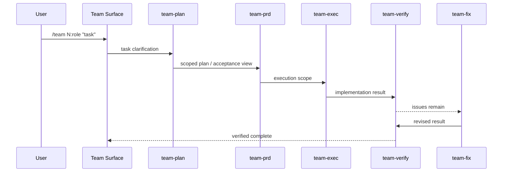
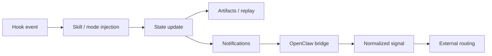

<!-- GENERATED BY build_obsidian_vaults.py -->
# 02 Learning Paths

[[oh-my-claudecode Guide - MOC]]

> [!info]
> source: `01-learning-paths.md`  
> role: `learning-paths`

## Why this note exists

**OMC를 ‘기능 목록’이 아니라 ‘학습 순서와 독자 유형’ 기준으로 읽게 만드는 로드맵**

## Source-adapted content

# oh-my-claudecode 학습 경로

**OMC를 ‘기능 목록’이 아니라 ‘학습 순서와 독자 유형’ 기준으로 읽게 만드는 로드맵**

---

## 먼저 판단부터

OMC는 초심자가 README만 보고 감 잡기 쉬운 저장소가 아니다.

이유는 단순하다.

- 표면이 많다: `autopilot`, `team`, `ralph`, `omc team`, `/ccg`, `omc ask`, hooks, HUD, OpenClaw
- 문서가 한 층이 아니다: README / MIGRATION / REFERENCE / ARCHITECTURE / PERFORMANCE 문서가 각각 역할이 다르다
- 구현 표면도 넓다: `agents/`, `skills/`, `bridge/`, `src/team/`, `src/hooks/`, `src/openclaw/`, `src/hud/`
- 운영 흔적도 있다: `benchmarks/`, `benchmark/`, `missions/`, `.omc/`

그래서 좋은 학습 경로는 “뭘 다 읽어라”가 아니라,
**누가 어떤 질문을 갖고 들어왔는지에 따라 읽는 순서를 분리**해야 한다.

---

## 이 문서의 원칙

이 학습 경로는 네 가지 원칙으로 짰다.

1. **frontdoor를 먼저 잡는다**
   - OMC가 무엇인지, 현재 중심 표면이 무엇인지 먼저 안다.

2. **Team과 runtime을 구분해서 배운다**
   - `/team`과 `omc team`은 관련은 깊지만 같은 층위가 아니다.

3. **docs와 src를 함께 보게 만든다**
   - OMC는 README만 보면 과소평가되고,
   - src만 보면 맥락 없이 구현 세부에 빠지기 쉽다.

4. **독자 유형별 경로를 분리한다**
   - 사용자
   - 운영자
   - 통합 담당자
   - 기여자

---

## 전체 로드맵

| 단계 | 핵심 질문 | 목표 |
|---|---|---|
| 1단계. frontdoor | OMC는 정확히 뭐지? | 현재 기준의 정체와 중심 표면을 잡는다 |
| 2단계. orchestration | 왜 Team이 핵심이지? | `autopilot` / `team` / `ralph` 차이를 안다 |
| 3단계. runtime | `omc team`, `.omc/`, HUD는 왜 필요하지? | 운영 표면과 상태 구조를 본다 |
| 4단계. integration | hooks와 OpenClaw는 어떻게 이어지지? | 외부 연동과 lifecycle 구조를 읽는다 |
| 5단계. contributor reading | 실제 구현과 drift는 어디서 보지? | docs + src + repo breadth를 같이 읽는다 |

### Mermaid 로 보는 reading map

```mermaid
flowchart LR
    A[1. Frontdoor] --> B[2. Orchestration]
    B --> C[3. Runtime]
    C --> D[4. Integration]
    D --> E[5. Contributor Reading]

    A --> A1[README]
    A --> A2[package naming]
    A --> A3[repo anatomy]

    B --> B1[autopilot]
    B --> B2[/team]
    B --> B3[ralph]

    C --> C1[omc team]
    C --> C2[.omc state]
    C --> C3[HUD / replay / observability]

    D --> D1[hooks]
    D --> D2[notifications]
    D --> D3[OpenClaw signal routing]

    E --> E1[docs drift]
    E --> E2[src structure]
    E --> E3[benchmarks / missions]
```

이 맵이 말하는 핵심은 이것이다.

> **OMC는 한 번에 다 배우는 툴이 아니라, 층위별로 읽어야 하는 시스템이다.**

---

## 빠른 선택: 나는 어디서 시작해야 하나?

### 1) 그냥 빨리 써보고 싶은 사용자
읽기 순서:
1. `README.md`
2. 원본 `README.md`
3. 이 문서의 **사용자 트랙**
4. `02-glossary.md`

목표:
- `autopilot`, `team`, `ralph` 차이를 안다.
- `/team`과 `omc team`을 헷갈리지 않는다.

### 2) OMC를 운영자로 쓰려는 사람
읽기 순서:
1. `README.md`
2. 원본 `docs/REFERENCE.md`
3. 원본 `docs/MIGRATION.md`
4. 원본 `docs/PERFORMANCE-MONITORING.md`
5. `src/hud/`, `src/team/`

목표:
- tmux worker runtime을 이해한다.
- HUD / replay / session summary / state를 다룰 수 있다.

### 3) OpenClaw/외부 연동을 붙이려는 사람
읽기 순서:
1. `README.md`의 OpenClaw 구간
2. 원본 `docs/OPENCLAW-ROUTING.md`
3. 원본 `docs/REFERENCE.md`의 hooks/configuration 관련 구간
4. `src/openclaw/`, `src/notifications/`

목표:
- normalized signal contract를 설명할 수 있다.
- raw event가 아니라 `signal.routeKey` 중심으로 이해한다.

### 4) 기여/분석 관점으로 읽는 사람
읽기 순서:
1. 원본 `README.md`
2. 원본 `docs/MIGRATION.md`
3. 원본 `docs/ARCHITECTURE.md`
4. 원본 `docs/REFERENCE.md`
5. `agents/`, `skills/`, `bridge/`, `src/`, `benchmarks/`, `missions/`

목표:
- docs끼리 왜 강조점이 다른지 이해한다.
- 구현과 문서의 기준선 차이를 읽어낼 수 있다.

---

## 1단계 — frontdoor: OMC를 한 문장으로 설명할 수 있게 만들기

### 목표

이 단계가 끝나면 아래 네 문장을 설명할 수 있어야 한다.

- OMC는 **Claude Code 위에 얹는 운영 런타임**이다.
- 현재 중심 표면은 **Team**이다.
- `oh-my-claudecode`와 `oh-my-claude-sisyphus`는 같은 프로젝트의 다른 이름 층위다.
- 원본 repo는 quick-start 문서 repo가 아니라 **docs + runtime + monitoring + integration** repo다.

### 읽을 것

1. 이 가이드의 `README.md`
2. 원본 `README.md`
3. 원본 `package.json`
4. `UPSTREAM-SNAPSHOT.md`

### 이 단계에서 꼭 잡아야 할 사실

#### A. 이름이 둘이다

```text
repo / plugin / command branding: oh-my-claudecode
npm package: oh-my-claude-sisyphus
```

#### B. 설치 경로 설명도 문서마다 결이 다를 수 있다

- README는 plugin + npm path를 같이 보여준다.
- `docs/REFERENCE.md`는 plugin-only 지원을 더 강하게 말한다.

즉 학습자는 **현재 권장 경로**와 **역사적/보조 경로**를 구분해서 읽어야 한다.

#### C. repo anatomy를 모르고 들어가면 OMC를 과소평가한다

최소한 아래는 초반에 보고 지나가야 한다.
- `docs/`
- `agents/`
- `skills/`
- `bridge/`
- `src/team/`
- `src/hooks/`
- `src/openclaw/`
- `src/hud/`
- `benchmarks/`, `benchmark/`
- `missions/`

### 체크리스트

- [ ] OMC를 “Claude Code 운영 런타임”으로 설명할 수 있다.
- [ ] Team이 current canonical surface라는 걸 안다.
- [ ] package naming 차이를 안다.
- [ ] repo breadth를 최소한 한 번은 훑었다.

---

## 2단계 — orchestration: `autopilot` / `team` / `ralph`를 구분하기

### 목표

- OMC를 단순 자동화 도구로 오해하지 않는다.
- Team pipeline을 단계별로 설명할 수 있다.
- `ralph`가 왜 “보증/집착 레이어”인지 이해한다.

### 읽을 것

1. 원본 `README.md`의 Quick Start / Team / tmux worker 구간
2. 원본 `docs/MIGRATION.md`
3. `02-glossary.md`

### 핵심 개념

#### Autopilot
- 가장 빨리 체감 가능한 entry surface
- 자연어 요청을 end-to-end 실행으로 연결하는 감각을 보여준다

#### Team
- 현재 OMC의 canonical orchestration surface
- staged pipeline이 핵심

```text
team-plan → team-prd → team-exec → team-verify → team-fix
```

#### Ralph
- verify/fix 지속 루프를 강하게 요구하는 persistence mode
- “한 번 해봤다”가 아니라 “끝났는지 확인한다” 쪽에 가깝다

### Team pipeline을 읽는 관점



### 체크리스트

- [ ] `autopilot`과 `team` 차이를 설명할 수 있다.
- [ ] `team`과 `ralph` 차이를 설명할 수 있다.
- [ ] Team pipeline 각 단계를 말할 수 있다.
- [ ] Team이 단순 fan-out이 아니라는 점을 안다.

---

## 3단계 — runtime: `omc team`, `.omc/`, HUD, replay 읽기

### 목표

- 최신 OMC에서 runtime surface가 얼마나 중요한지 안다.
- 상태/관측 계층까지 포함해서 OMC를 본다.

### 읽을 것

1. 원본 `docs/REFERENCE.md`
2. 원본 `docs/PERFORMANCE-MONITORING.md`
3. 원본 `docs/MIGRATION.md`의 Team runtime deprecation 구간
4. `src/team/`, `src/hud/`

### 핵심 포인트

#### 1. `omc team`은 실제 CLI worker runtime이다

```bash
omc team 2:codex "review auth flow"
omc team status review-auth-flow
omc team shutdown review-auth-flow --force
```

#### 2. OMC는 상태를 남긴다

대표 경로:
- `.omc/artifacts/ask/`
- `.omc/sessions/`
- `.omc/state/agent-replay-*.jsonl`
- `.omc/notepads/`

#### 3. observability 문서도 봐야 current reality가 보인다

`docs/PERFORMANCE-MONITORING.md` 기준으로 보면 OMC는:
- Agent Observatory
- Session Replay
- Session-end summaries
- HUD preset
같은 운영 표면을 공식적으로 다룬다.

#### 4. bench / mission 축도 runtime 성격의 일부다

- `benchmarks/`, `benchmark/`는 품질/성능 평가 성격을 보여준다.
- `missions/`는 실행 단위를 흔적으로 남기는 repo 기질을 보여준다.

### 체크리스트

- [ ] `omc team`이 runtime 표면이라는 걸 안다.
- [ ] `.omc/` 주요 하위 구조를 안다.
- [ ] replay / observatory / HUD가 왜 중요한지 안다.
- [ ] OMC를 운영자 관점으로 설명할 수 있다.

---

## 4단계 — integration: hooks / notifications / OpenClaw

### 목표

- OMC가 왜 “운영 체계”로 보이는지 설명할 수 있다.
- 외부 라우팅 계약을 이해한다.

### 읽을 것

1. 원본 `docs/ARCHITECTURE.md`
2. 원본 `docs/OPENCLAW-ROUTING.md`
3. 원본 `docs/REFERENCE.md`의 hooks/configuration 부분
4. `src/hooks/`, `src/openclaw/`, `src/notifications/`

### 이해해야 할 구조



#### hooks
- lifecycle 이벤트에 규칙을 걸어두는 층
- persistent mode, team pipeline, continuation 같은 동작이 여기서 살아난다

#### notifications
- 상태 변화/완료/질문을 외부 채널로 보내는 층

#### OpenClaw
- normalized `signal` contract를 갖는 공식 integration surface
- `routeKey`, `priority`, `phase` 중심으로 이해하는 게 맞다

### 체크리스트

- [ ] hooks의 역할을 설명할 수 있다.
- [ ] notifications와 OpenClaw의 관계를 안다.
- [ ] raw event보다 normalized signal이 중요하다는 걸 안다.
- [ ] OMC를 integration-ready runtime으로 볼 수 있다.

---

## 5단계 — contributor reading: docs drift와 구현 폭 읽기

### 목표

- 원본 문서들 사이의 기준선 차이를 이해한다.
- 기여자/리뷰어 관점으로 repo breadth를 읽는다.

### 먼저 볼 drift examples

| 항목 | 문서 | 관찰 |
|---|---|---|
| agent count | `README.md` vs `docs/ARCHITECTURE.md` | `32` vs `19` |
| skill count | `docs/REFERENCE.md` / `docs/ARCHITECTURE.md` / `docs/MIGRATION.md` | `32` / `31` / `37`처럼 기준선이 다름 |
| install path | README vs REFERENCE | plugin+npm vs plugin-only 강조 |
| Team runtime | README vs MIGRATION | current surface 설명 vs deprecation 설명 강도 차이 |

### 추천 읽기 순서

#### 문서 우선
1. `README.md`
2. `docs/MIGRATION.md`
3. `docs/REFERENCE.md`
4. `docs/ARCHITECTURE.md`
5. `docs/OPENCLAW-ROUTING.md`
6. `docs/PERFORMANCE-MONITORING.md`

#### 구조 우선
1. `agents/`
2. `skills/`
3. `bridge/`
4. `src/team/`
5. `src/hooks/`
6. `src/openclaw/`
7. `src/notifications/`
8. `src/hud/`
9. `src/features/`
10. `benchmarks/`, `benchmark/`, `missions/`

### contributor 질문 예시

- Team pipeline 설명은 코드에서 어디에 대응되는가?
- Team MCP runtime deprecation은 현재 CLI runtime 설계에 어떻게 반영됐는가?
- OpenClaw signal payload는 어디서 구성되는가?
- observability는 HUD와 replay에 어떻게 나뉘는가?
- docs count mismatch는 단순 갱신 누락인가, 문맥 차이인가?

### 체크리스트

- [ ] docs drift를 찾고 설명할 수 있다.
- [ ] `agents/`, `skills/`, `src/`를 각각 다른 층위로 볼 수 있다.
- [ ] benchmark/mission 축이 왜 중요한지 안다.
- [ ] 구현 reading 질문을 스스로 만들 수 있다.

---

## 추천 학습 루프

### 1회독 — frontdoor + orchestration
- `README.md`
- 원본 `README.md`
- `02-glossary.md`
- Team / autopilot / ralph 감 잡기

### 2회독 — runtime + state
- `docs/REFERENCE.md`
- `docs/MIGRATION.md`
- `docs/PERFORMANCE-MONITORING.md`
- `.omc/`, `src/team/`, `src/hud/`

### 3회독 — integration + contributor reading
- `docs/ARCHITECTURE.md`
- `docs/OPENCLAW-ROUTING.md`
- `src/hooks/`, `src/openclaw/`, `src/notifications/`
- `benchmarks/`, `missions/`

---

## 이 학습 경로의 결론

OMC를 가장 덜 헷갈리게 배우는 순서는 이거다.

> **frontdoor로 정체를 잡고 → Team으로 중심 철학을 배우고 → `omc team`과 `.omc/`로 runtime을 보고 → hooks/OpenClaw로 integration을 이해하고 → 마지막에 docs drift와 repo breadth까지 읽는다.**

그래야 OMC를 단순한 명령 세트가 아니라,
**실행·상태·관측·통합을 가진 운영 시스템**으로 이해할 수 있다.
