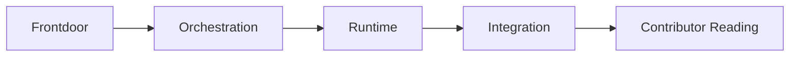

# OMC Learning Paths

> [!tip]
> Start with [[oh-my-claudecode Guide - MOC]] if you want the fastest frontdoor.

## What this note is for

OMC is easier to learn by **reading order and reader type**, not by scanning one giant feature list.

The important distinction is:
- orchestration surface
- runtime surface
- integration surface
- contributor surface

## Reading map

## Reader tracks

### 1. User track
Read:
- [[oh-my-claudecode Guide - MOC]]
- [[03 Glossary]]
- upstream README

Goal:
- explain autopilot / team / ralph
- not confuse `/team` with `omc team`

### 2. Operator track
Read:
- [[01 Overview]]
- upstream `docs/REFERENCE.md`
- upstream `docs/PERFORMANCE-MONITORING.md`

Goal:
- understand tmux workers
- understand HUD / replay / session summaries

### 3. Integration track
Read:
- [[Concepts/Hooks and State]]
- upstream `docs/OPENCLAW-ROUTING.md`
- `src/openclaw/`, `src/notifications/`

Goal:
- understand normalized signal routing

### 4. Contributor track
Read:
- [[01 Overview]]
- [[References/Source Map]]
- upstream `docs/MIGRATION.md`
- upstream `docs/ARCHITECTURE.md`
- upstream `docs/REFERENCE.md`

Goal:
- understand repo breadth and docs drift

## Stage model

1. Frontdoor
2. Team / orchestration
3. Runtime / observability
4. Hooks / OpenClaw integration
5. Contributor reading

## What to watch for

- README vs Architecture vs Migration may not use the exact same counts
- install guidance can differ by document context
- the repo is broader than quick-start usage alone

## Related notes

- [[01 Overview]]
- [[03 Glossary]]
- [[Concepts/Team vs omc team]]
- [[Concepts/Hooks and State]]
- [[References/Source Map]]
