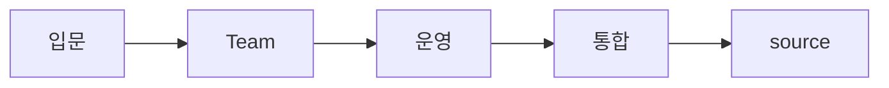

# 02 Learning Paths

[[oh-my-claudecode Guide - MOC]]

## 추천 경로

### 1단계 — 입문
- `README.md`
- 원본 `README.md`
- package naming 확인

### 2단계 — 중심 사용법
- Team pipeline
- Ralph
- `deep-interview`

### 3단계 — 운영 관점
- `omc team`
- tmux workers
- `.omc/` artifacts / state

### 4단계 — 확장/통합
- hooks
- notifications
- OpenClaw routing

### 5단계 — source reading
- `src/team/`
- `src/hooks/`
- `src/openclaw/`

## 순서 맵

## 함께 읽을 노트

- [[03 Glossary]]
- [[Concepts/Team vs omc team]]
- [[Workflows/Recommended Reading Flow]]
