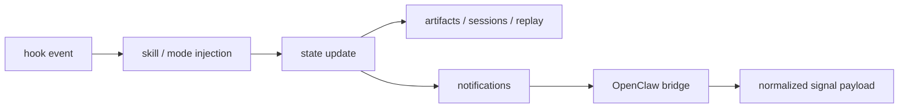

# Hooks and State

[[oh-my-claudecode Guide - MOC]]

> [!info]
> Read this note when OMC starts to feel like more than commands and you want to understand why.

## The short version

Hooks and state are the reason OMC is better understood as a runtime than as a prompt pack.

- **hooks** decide when behavior should activate
- **state** lets behavior continue, replay, summarize, and route outward

## Hooks

Hooks are lifecycle-linked behavior injection points.

In practice, this means they can power:
- persistent mode behavior
- team pipeline behavior
- todo continuation
- notifications
- external routing

So hooks are not decorative extension points. They are one of the main reasons OMC behaves like a system.

## State

State is the memory of execution.

Common places to inspect:
- `.omc/sessions/`
- `.omc/artifacts/`
- `.omc/state/`
- `.omc/notepads/`

State makes these possible:
- replay
- session summaries
- continuity across context changes
- persistent execution patterns
- accumulated notepad wisdom

## Hooks → state → routing flow

## Why OpenClaw belongs in this concept note

OpenClaw is not just “another integration.”

It matters here because it shows what happens after internal runtime state becomes externally routable information.

The key shift is:
- raw hook event
- becomes normalized signal
- becomes downstream routing payload

That is a runtime/system story, not just a feature checkbox.

## Where to verify this in upstream

- `docs/ARCHITECTURE.md`
- `docs/REFERENCE.md`
- `docs/OPENCLAW-ROUTING.md`
- `docs/PERFORMANCE-MONITORING.md`
- `src/hooks/`
- `src/openclaw/`
- `src/hud/`

## What becomes easier once this clicks

- why `.omc/` matters
- why replay and observability matter
- why notifications are not just afterthoughts
- why OMC feels larger than a command collection

## Related notes

- [[03 Glossary]]
- [[02 Learning Paths]]
- [[Concepts/Team vs omc team]]
- [[References/Source Map]]
