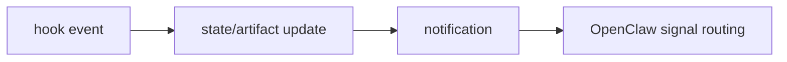

# Hooks and State

[[oh-my-claudecode Guide - MOC]]

## 왜 중요한가

OMC를 명령어 묶음이 아니라 **운영 런타임**으로 보게 만드는 핵심이 여기 있다.

## hooks
- lifecycle 이벤트 감지
- 행동 주입
- persistent mode / team pipeline / notifications 같은 운영 규칙 연결

## state
- `.omc/sessions/`
- `.omc/artifacts/`
- `.omc/state/`
- replay / context continuity

## OpenClaw까지 이어지는 흐름

## 같이 읽을 노트

- [[03 Glossary]]
- [[References/Source Map]]
