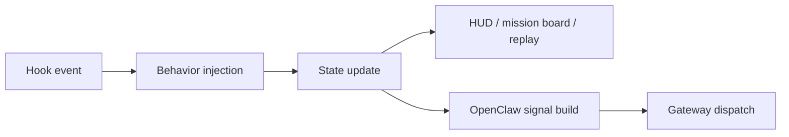

<!-- GENERATED BY build_obsidian_vaults.py -->
# Hooks openclaw and observability

[[oh-my-claudecode Guide - MOC]]

> [!info]
> source: `sections/03-hooks-openclaw-and-observability.md`  
> role: `section`

## Why this note matters

이 문서는 OMC가 왜 단순 명령 집합보다 **운영 런타임**처럼 보이는지, 그 핵심 축 세 개를 source 기준으로 묶어서 설명한다.

## Source-adapted content

# Hooks, OpenClaw, and Observability

## 이 섹션의 역할

이 문서는 OMC가 왜 단순 명령 집합보다 **운영 런타임**처럼 보이는지,
그 핵심 축 세 개를 source 기준으로 묶어서 설명한다.

- hooks
- OpenClaw routing
- HUD / mission board / replay 같은 observability

---

## 먼저 결론

OMC의 정체를 바꾸는 건 command surface보다 이쪽이다.

- hooks는 **언제 행동을 주입할지** 결정하고
- OpenClaw는 **그 행동/상태를 바깥으로 어떻게 라우팅할지** 결정하고
- observability는 **지금 무엇이 일어나고 있는지 어떻게 보게 할지** 결정한다

즉 이 셋을 함께 보면 OMC는:
- 프롬프트 묶음이 아니라
- slash command 모음이 아니라
- **상태와 이벤트를 다루는 시스템**으로 읽힌다

---

## hooks: 행동 주입 계층

원본 `src/hooks/`를 보면 영역이 매우 넓다.

대표 축만 뽑아도 이렇다.
- autopilot
- persistent-mode
- ralph
- team-pipeline
- team dispatch / team worker hook
- session-end
- setup
- learner
- project-memory
- rules injector
- todo continuation
- think mode
- bridge

이건 중요한 사실을 말해준다.

> hooks는 보조 기능이 아니라,
> OMC의 행동을 실제로 바꾸는 주입 계층이다.

### `src/hooks/index.ts`가 보여주는 것

이 index를 보면 exports 자체가 OMC의 성격을 설명한다.

- Ralph loop / PRD / progress / verifier
- Todo continuation
- Hook bridge
- Think mode
- Rules injector
- OMC orchestrator
- Auto slash command
- Comment checker

즉 hooks는 “event listener 몇 개”가 아니라,
**mode / memory / continuation / orchestration / verification**을 한꺼번에 묶는 계층이다.

---

## OpenClaw: normalized routing 계층

### `src/openclaw/index.ts`가 보여주는 것

이 파일에서 중요한 포인트:
- public API로 export됨
- `wakeOpenClaw()`가 hook event를 받아 처리
- config resolve → gateway resolve → signal build → payload assemble → dispatch
- reply channel context, tmux context, whitelisted context를 함께 다룸
- failure는 hook를 깨지 않도록 swallow

이 설계는 분명하다.

> OpenClaw integration은 부가 webhook이 아니라,
> **hook event를 normalized payload로 바꾸어 외부 시스템에 깨끗하게 전달하는 공식 bridge**다.

### `src/openclaw/signal.ts`가 보여주는 것

여기서 핵심은 raw event를 그대로 넘기지 않는다는 점이다.

예를 들어 signal은 다음처럼 정규화된다.
- `kind`
- `name`
- `phase`
- `routeKey`
- `priority`

그리고 tool/use context에 따라:
- test run 감지
- PR create 감지
- tool failure/high priority 구분
- question requested 구분
까지 수행한다.

즉 downstream은 raw hook name보다,
**routing-friendly signal contract**를 보는 편이 맞다.

---

## observability: 상태를 보이게 만드는 계층

### `src/hud/index.ts`가 보여주는 것

HUD는 단순 statusline 렌더러 이상이다.

초반 import만 봐도 아래가 연결된다.
- stdin/session context
- transcript parsing
- HUD state 읽기/쓰기
- Ralph / Ultrawork / PRD / Autopilot state
- usage API
- custom provider
- render
- mission board refresh
- session summary spawn

즉 HUD는:
- 현재 세션 문맥
- runtime state
- mode state
- mission board
- summary artifact
를 한데 묶는 관측 허브다.

### `src/hud/mission-board.ts`가 보여주는 것

mission board는 단순 decorative HUD element가 아니다.

이 파일에서 보이는 것:
- session/team source 구분
- mission status / agent status / timeline event 모델
- task count, worker count, blocked/running/done 상태
- persisted mission-state.json
- canonicalizeWorkers 사용

즉 mission board는 OMC가 **작업 흐름을 시각화 가능한 상태 객체**로 다룬다는 증거다.

---

## 세 축을 함께 보면 생기는 그림

이 그림의 포인트는 단순하다.

- hooks가 행동을 바꾸고
- state가 흔적을 남기고
- HUD가 그걸 보여주고
- OpenClaw가 바깥으로 라우팅한다

그래서 OMC는 기능 집합이 아니라 **eventful runtime**으로 읽힌다.

---

## guide에 반영해야 하는 함의

### 1. OpenClaw를 README 맨 아래 integration bullet 정도로만 다루면 부족하다

실제론 source와 routing contract가 따로 있을 정도로 명확한 축이다.

### 2. HUD를 “예쁜 상태줄” 정도로 설명하면 과소평가다

실제로는 session summary, mission board, mode state, usage, transcript 문맥과 얽힌 관측 허브다.

### 3. hooks를 extension point 정도로 축소하면 안 된다

hooks는 OMC의 **행동 주입 본체**다.

---

## source-backed reading order

이 축을 이해하려면 이 순서가 좋다.

1. 원본 `docs/ARCHITECTURE.md`
2. 원본 `docs/OPENCLAW-ROUTING.md`
3. 원본 `docs/PERFORMANCE-MONITORING.md`
4. `src/hooks/index.ts`
5. `src/openclaw/index.ts`
6. `src/openclaw/signal.ts`
7. `src/hud/index.ts`
8. `src/hud/mission-board.ts`

---

## 한 줄 판단

> **OMC를 런타임으로 만드는 핵심은 hooks가 행동을 주입하고, state/observability가 그 행동을 추적하며, OpenClaw가 그 상태를 normalized signal로 외부에 연결하는 구조에 있다.**
