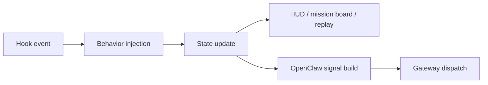

# OpenClaw and Observability

[[oh-my-claudecode Guide - MOC]]

> [!info]
> This note ties together hooks, OpenClaw routing, HUD, mission board, and replay.

## Short judgment

OMC becomes much easier to understand once you see this flow:
- hooks decide when behavior activates
- state preserves the execution trail
- HUD/mission board expose that trail
- OpenClaw turns it into a normalized routing payload

## Key upstream files

- `src/hooks/index.ts`
- `src/openclaw/index.ts`
- `src/openclaw/signal.ts`
- `src/hud/index.ts`
- `src/hud/mission-board.ts`

## Why OpenClaw is not a side feature

The source shows a dedicated bridge that:
- resolves gateway config
- builds normalized signals
- assembles whitelisted payloads
- dispatches non-blocking

That is an integration subsystem, not just a webhook helper.

## Why HUD is not just cosmetic

HUD ties together:
- session context
- mode state
- usage
- mission board
- session summaries
- runtime visibility

## Concept map

## Related notes

- [[Concepts/Hooks and State]]
- [[03 Glossary]]
- [[References/Source Map]]
