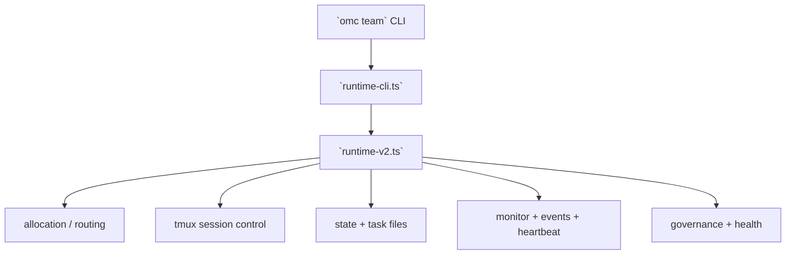

# Team Runtime Deep Dive

[[oh-my-claudecode Guide - MOC]]

> [!info]
> Read this note when `/team` is no longer enough and you need to understand the runtime subsystem behind `omc team`.

## Short judgment

`omc team` is not just a command surface.
It sits on top of a runtime subsystem that includes:
- runtime entry
- task allocation
- tmux session control
- state paths
- monitor/events/heartbeat
- governance and worker health

## Key upstream files

- `src/team/runtime-cli.ts`
- `src/team/runtime-v2.ts`
- `src/team/tmux-session.ts`
- `src/team/monitor.ts`
- `src/team/events.ts`
- `src/team/heartbeat.ts`
- `src/team/governance.ts`
- `src/team/worker-health.ts`

## What the source implies

- Team runtime has moved toward event-driven lifecycle control
- legacy done-file polling is being reduced in importance
- tmux is the worker substrate, not just a dependency line
- runtime complexity is high enough to justify a large dedicated test suite

## Runtime shape

## Why this matters

Once this clicks, OMC stops looking like a pile of commands and starts looking like a runtime with workers, lifecycle, and operator surfaces.

## Related notes

- [[Concepts/Team vs omc team]]
- [[Concepts/Hooks and State]]
- [[References/Source Map]]
