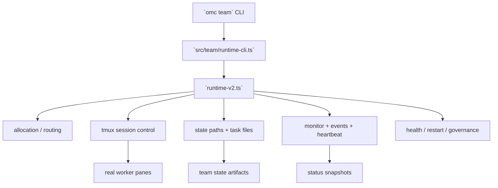

<!-- GENERATED BY build_obsidian_vaults.py -->
# Team runtime and worker model

[[oh-my-claudecode Guide - MOC]]

> [!info]
> source: `sections/02-team-runtime-and-worker-model.md`  
> role: `section`

## Why this note matters

이 문서는 OMC의 Team을 **개념 설명**이 아니라 **runtime 구조** 기준으로 읽게 만든다.

## Source-adapted content

# Team Runtime and Worker Model

## 이 섹션의 역할

이 문서는 OMC의 Team을 **개념 설명**이 아니라 **runtime 구조** 기준으로 읽게 만든다.

즉 질문은 이거다.

- Team은 실제로 어떤 파일 군에서 굴러가나?
- `omc team`은 어떤 책임을 갖나?
- worker 운영, 상태, 모니터링은 어디서 이어지나?

---

## 먼저 결론

OMC의 Team은 단일 파일짜리 orchestration이 아니다.

원본 `src/team/`을 보면, 실제로는 아래가 분리되어 있다.

- **runtime entry**
- **worker allocation / routing**
- **tmux session control**
- **state paths / task files**
- **phase inference**
- **monitoring / events / heartbeat**
- **governance / permissions / restart / health**

즉 Team은 “여러 worker를 띄운다”보다,
**worker lifecycle을 계속 운영하는 미니 런타임**에 가깝다.

---

## `src/team/`에서 먼저 봐야 하는 파일들

### 1. `runtime-v2.ts`

이 파일은 현재 Team runtime의 핵심 방향을 보여준다.

초반 주석에서 바로 드러나는 포인트:
- event-driven runtime v2
- legacy polling watchdog 대체
- `done.json` polling 제거
- CLI API lifecycle transition 기반 동작
- start / monitor / shutdown / assign / resume가 분리된 operation

이건 중요한 신호다.

> Team runtime은 단순 sleep loop가 아니라,
> **이벤트/상태 기반 lifecycle 제어** 쪽으로 이동하고 있다.

### 2. `runtime-cli.ts`

이 파일은 Team runtime의 CLI entry 성격을 보여준다.

핵심 책임:
- stdin JSON 입력 받기
- runtime 시작/모니터링/종료 연결
- task result artifact 쓰기
- watchdog failed marker 확인
- pane metadata/result artifact 관리

즉 `omc team`은 표면 명령이지만,
그 아래는 **구조화된 JSON 입출력과 artifact 관리**를 동반한 runtime entry다.

### 3. `tmux-session.ts`

README만 보면 tmux는 의존성처럼 보이지만,
실제로는 worker lifecycle의 기반이다.

여기서 기대할 수 있는 책임:
- team session/window 생성
- pane spawn
- pane ready/wait
- pane liveness 확인
- worker로 instruction 전달

즉 tmux는 주변 도구가 아니라 **worker substrate**다.

### 4. `allocation-policy.ts`, `role-router.ts`, `task-router.ts`

이 파일군은 Team이 단순 fan-out이 아니라,
**누가 어떤 작업을 맡아야 하는가**를 결정하는 계층이 따로 있음을 보여준다.

### 5. `monitor.ts`, `events.ts`, `heartbeat.ts`, `worker-health.ts`

이 파일군은 Team이 한 번 실행하고 끝나는 게 아니라,
**살아있는 worker 집단을 감시**한다는 사실을 보여준다.

### 6. `governance.ts`, `permissions.ts`, `sentinel-gate.ts`

이 파일군은 Team이 단순 병렬화 툴이 아니라,
**제어와 안전장치**를 가진 시스템이라는 점을 드러낸다.

---

## Team runtime을 읽는 구조도

이 다이어그램이 답하는 건 이거다.

> **Team은 어디서 실제 runtime이 되는가?**

답은 `runtime-v2.ts` 단독이 아니라,
그 주변 파일군 전체다.

---

## 왜 test 파일 수가 중요한가

`src/team/__tests__/`를 보면 테스트 범위가 아주 넓다.

대충 봐도 아래가 테스트된다.
- dispatch
- CLI dialect/interop
- governance
- heartbeat
- idle nudge
- outbox reader
- permissions
- runtime-v2
- shutdown
- tmux session spawn
- worker restart
- status
- summary report

이건 가이드 관점에서 중요한 신호다.

> upstream이 Team을 단순 UX feature가 아니라,
> **상태 많고 실패 가능성이 높은 runtime 시스템**으로 취급하고 있다는 뜻이다.

즉 Team 가이드는 예제 몇 줄만 보여주면 안 되고,
runtime complexity가 있다는 사실까지 보여줘야 한다.

---

## worker lifecycle을 읽는 관점

### 1. start
- 팀 이름 sanitize/validate
- state root 준비
- session/window/pane 준비
- worker bootstrap 메시지 구성

### 2. claim / assignment
- task allocation
- owner/worker mapping
- phase 추론 또는 transition

### 3. run
- pane readiness 확인
- inbox/dispatch 전송
- status/heartbeat 업데이트

### 4. monitor
- dead worker 탐지
- non-reporting worker 탐지
- recommendations 생성
- snapshot 갱신

### 5. shutdown / cleanup
- shutdown request/ack
- team state cleanup
- worktree/pane cleanup
- result artifact 정리

이 순서를 보면 `omc team`은 그냥 “CLI로 worker 여러 개 띄움”이 아니라,
**작은 배치/오케스트레이션 런타임**이라고 보는 편이 맞다.

---

## guide에 반영해야 하는 함의

### 1. `/team`과 `omc team`을 절대 같은 표면으로 설명하면 안 된다

- `/team` → orchestration mental model
- `omc team` → runtime/operator mental model

### 2. tmux를 단순 requirement 표에만 넣으면 부족하다

tmux는 그냥 설치 항목이 아니라,
**worker substrate**라는 점을 설명해야 한다.

### 3. Team은 현재 OMC의 핵심 브랜드 메시지이면서 동시에 핵심 runtime 복잡도다

즉 README의 frontdoor 메시지와 `src/team/`의 시스템 복잡도를
**둘 다 보여줘야 public guide로서 정직하다.**

---

## source-backed reading order

Team runtime을 이해하려면 이 순서가 좋다.

1. 원본 `README.md`의 Team / tmux worker 구간
2. 원본 `docs/MIGRATION.md`의 Team runtime deprecation 구간
3. 원본 `docs/REFERENCE.md`의 `omc team` 구간
4. `src/team/runtime-cli.ts`
5. `src/team/runtime-v2.ts`
6. `src/team/tmux-session.ts`
7. `src/team/monitor.ts`, `events.ts`, `heartbeat.ts`
8. `src/team/governance.ts`, `permissions.ts`, `worker-health.ts`

---

## 한 줄 판단

> **OMC의 Team은 사용자에게는 orchestration surface로 보이지만, 소스 레벨에서는 tmux, state, task lifecycle, monitor, governance가 결합된 runtime subsystem이다.**
