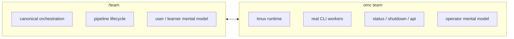

# Team vs omc team

[[oh-my-claudecode Guide - MOC]]

> [!warning]
> This is one of the most important distinctions in OMC. If you blur these two surfaces together, the whole project becomes harder to read.

## The short version

| Surface | Meaning | Best mental model |
|---|---|---|
| `/team` | canonical orchestration surface | learner/user-facing workflow surface |
| `omc team` | tmux CLI worker runtime | operator/runtime-facing execution surface |

## Why this distinction matters

If you treat both as synonyms, OMC looks like a command alias set.

That is the wrong picture.

The better picture is:
- Team = **how work is structured**
- `omc team` = **how workers are actually operated**

## Team as orchestration surface

Team is the current canonical orchestration surface in upstream docs.

The key idea is not “many agents” but **staged lifecycle management**.

```text
team-plan → team-prd → team-exec → team-verify → team-fix
```

That means Team should be read as:
- scoping
- planning
- execution
- verification
- correction loop

## `omc team` as runtime surface

`omc team` is where runtime reality becomes visible.

Examples:
```bash
omc team 2:codex "review auth flow"
omc team status review-auth-flow
omc team shutdown review-auth-flow --force
```

This surface tells you:
- tmux matters
- real CLI workers matter
- start/status/shutdown lifecycle matters
- operator control matters

## Visual comparison



## How upstream docs split the responsibility

- `README.md` explains Team as the current frontdoor orchestration surface
- `docs/MIGRATION.md` explains why legacy Team MCP runtime paths are deprecated
- `docs/REFERENCE.md` explains `omc team` commands and runtime usage
- `src/team/` contains the deeper implementation reality

## What this changes in how you read OMC

Once this distinction is clear:
- README becomes easier to trust without over-trusting it
- Migration stops looking like side trivia
- `src/team/` becomes easier to place conceptually
- OMC stops looking like “a lot of similar commands”

## Related notes

- [[02 Learning Paths]]
- [[03 Glossary]]
- [[Concepts/Hooks and State]]
- [[References/Source Map]]
