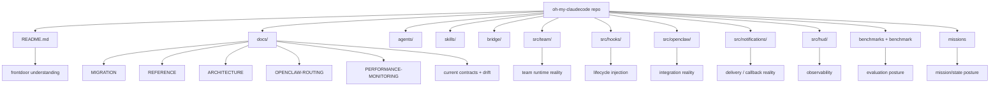

# Source Map

[[oh-my-claudecode Guide - MOC]]

> [!info]
> Read this note when you want to map **which directory answers which question**.

## What this note does

The upstream repo is broad enough that a flat file list is not useful.

This note answers:
- where the frontdoor lives
- where runtime reality lives
- where integration reality lives
- where observability/evaluation posture lives
- where contributor-grade reading should begin

## Core upstream docs

| Path | What it answers |
|---|---|
| `README.md` | current frontdoor, quick-start, Team-first message |
| `docs/MIGRATION.md` | what changed, what was deprecated, why CLI-first matters |
| `docs/REFERENCE.md` | command/config/env/hook reference surface |
| `docs/ARCHITECTURE.md` | hooks/skills/agents/state mental model |
| `docs/OPENCLAW-ROUTING.md` | normalized OpenClaw routing contract |
| `docs/PERFORMANCE-MONITORING.md` | observability, replay, HUD, session summaries |

## Core upstream directories

| Path | Why it matters |
|---|---|
| `agents/` | role-specific executors and their prompts |
| `skills/` | workflow/behavior injection surfaces users actually feel |
| `bridge/` | CLI/runtime entrypoints and bridge layer |
| `src/team/` | Team runtime reality |
| `src/hooks/` | lifecycle injection and persistent behavior |
| `src/openclaw/` | OpenClaw public API, payload, signal builder |
| `src/notifications/` | callback and delivery surfaces |
| `src/hud/` | HUD / mission board / live observability |
| `src/features/` | deeper runtime features like notepad/state helpers |
| `benchmarks/`, `benchmark/` | evaluation posture, benchmark artifacts, comparison mindset |
| `missions/` | mission/state posture and persistent work traces |
| `examples/` | usage-oriented examples |

## Repo reading map

## Where to look by question

### “How should a new user understand OMC?”
- `README.md`
- [[01 Overview]]
- [[02 Learning Paths]]

### “What changed between old and current OMC?”
- `docs/MIGRATION.md`
- `README.md`

### “Where does Team runtime actually live?”
- `src/team/`
- `bridge/team*.cjs`
- `docs/REFERENCE.md`

### “Where do hooks and persistence behaviors live?”
- `src/hooks/`
- `docs/ARCHITECTURE.md`
- [[Concepts/Hooks and State]]

### “Where does OpenClaw routing happen?”
- `docs/OPENCLAW-ROUTING.md`
- `src/openclaw/`

### “Where do I inspect replay / observability / mission status?”
- `docs/PERFORMANCE-MONITORING.md`
- `src/hud/`
- `.omc/state/`
- `.omc/sessions/`

## Drift watchlist

- README, Architecture, Reference, and Migration do not always expose the same counts.
- install guidance differs by document context.
- Team current surface and Team migration history must be read together.

## Reading questions worth carrying

- Team pipeline explanation: where does each stage map into implementation?
- `omc team` runtime: which files own start/status/shutdown behavior?
- OpenClaw signal payload: where is `routeKey` built?
- HUD vs replay vs session summary: what belongs to which observability layer?
- benchmark and mission folders: what do they reveal about the repo's operating posture?

## Related notes

- [[01 Overview]]
- [[02 Learning Paths]]
- [[Concepts/Team vs omc team]]
- [[Concepts/Hooks and State]]
