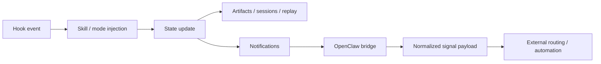

# oh-my-claudecode 개요

## 이 섹션의 역할

이 문서는 세 가지를 빠르게 정리한다.

1. 원본 저장소가 지금 어떤 프로젝트인지
2. 이번 guide가 무엇을 근거로 재작성되었는지
3. 학습자가 어떤 순서로 원본을 읽어야 덜 헤매는지

---

## 원본 저장소 역할

- repo: `oh-my-claudecode`
- source: `https://github.com/Yeachan-Heo/oh-my-claudecode.git`
- synced commit basis: `fae376508355fb03ea6a2477453f37f0a59e707f`
- npm package: `oh-my-claude-sisyphus@4.9.3`

### 한 줄 요약

**Claude Code 위에 멀티 에이전트 orchestration, persistent execution, tmux CLI workers, hooks, HUD, notifications, OpenClaw routing을 얹는 운영 런타임**

---

## 이번 가이드 재작성 판단

기존 guide는 정보가 전혀 없던 수준은 아니었지만, 학습 가이드로서 중요한 구조가 약했다.

특히 문제가 된 지점은 아래였다.

1. **frontdoor가 약했다**
   - 무엇인지보다 기능 나열이 먼저 보였다.
2. **학습 순서가 충분히 강하게 설계되지 않았다**
   - 초심자가 어디부터 봐야 하는지 선명하지 않았다.
3. **원본 docs와 source를 함께 읽은 흔적이 frontdoor에 충분히 드러나지 않았다**
   - README만 본 요약처럼 읽힐 여지가 있었다.
4. **중요한 드리프트 포인트가 구조적으로 정리되지 않았다**
   - Team canonical surface, CLI-first worker 방향, package naming 차이 같은 핵심 혼동 포인트가 더 전면에 나와야 했다.

그래서 이번에는 문장 손질보다 **문서 구조 재배치**를 우선했다.

---

## 실제로 확인한 upstream evidence

### 1. README

여기서 확인한 핵심:
- Quick Start 흐름
- Team이 canonical surface라는 현재 입장
- tmux CLI workers (`omc team`) 강조
- `/ccg`, `omc ask` 같은 multi-provider 표면
- package naming note

### 2. `docs/MIGRATION.md`

여기서 확인한 핵심:
- legacy Team MCP runtime의 deprecation 맥락
- `omc team` CLI-first 방향 강화
- 과거/현재 표면 차이 정리

### 3. `docs/REFERENCE.md`

여기서 확인한 핵심:
- installation/configuration 설명의 현재 기준
- `omc ask`, `omc team`, session 관련 명령
- state directory와 hooks, 환경 변수 맥락

### 4. `docs/ARCHITECTURE.md`

여기서 확인한 핵심:
- hooks / skills / agents / state라는 시스템 설명 축
- OMC를 “행동 주입 + 실행 + 상태 관리” 구조로 보는 관점

### 5. `docs/OPENCLAW-ROUTING.md`

여기서 확인한 핵심:
- OpenClaw bridge payload 구조
- `signal` 중심의 normalized routing contract
- raw event보다 routeKey/priority를 중시하는 최근 방향

이 흐름은 OMC를 단순 프롬프트 세트가 아니라 **실행 이벤트를 바깥으로 연결하는 운영 런타임**으로 보게 만든다.

### 6. 실제 디렉터리 구조

직접 확인한 핵심 폴더:
- `agents/`
- `skills/`
- `bridge/`
- `docs/`
- `src/team/`
- `src/hooks/`
- `src/openclaw/`
- `src/notifications/`
- `src/hud/`
- `src/features/`

이 구조를 보면 OMC는 정말로 **프롬프트 모음보다 런타임 구조** 쪽이 더 본체에 가깝다.

---

## 학습자가 먼저 알아야 할 사실

### 1. Team이 중심이다

지금 OMC를 배울 때는 Team을 중심축으로 잡아야 한다. 예전 표현이나 오래된 예제 기준으로 접근하면 학습 순서가 어긋난다.

### 2. `omc team`은 운영 레이어다

Team을 다 안다고 해서 `omc team`까지 안다고 볼 수는 없다. `omc team`은 tmux pane에서 실제 CLI worker를 굴리는 운영자 표면이다.

### 3. OMC는 상태와 후처리를 가진 시스템이다

`src/hooks/`, `.omc/`, artifacts, routing 문서를 보면, OMC는 단발성 명령보다 **지속 상태와 lifecycle 제어**에 더 큰 특징이 있다.

### 4. OpenClaw는 부록이 아니다

OpenClaw routing은 별도 문서와 소스 디렉터리가 존재할 만큼 명확한 통합 레이어다. 특히 외부 알림/자동화 흐름을 보는 사람에게는 핵심이다.

### 5. package naming 차이는 반드시 초반에 짚어야 한다

초심자 입장에서 가장 실수하기 쉬운 포인트다.

- branding/repo/plugin: `oh-my-claudecode`
- npm package: `oh-my-claude-sisyphus`

---

## 추천 원본 읽기 순서

### 빠른 이해용

1. 원본 `README.md`
2. 원본 `docs/MIGRATION.md`
3. 원본 `docs/REFERENCE.md`

### 구조 이해용

1. 원본 `docs/ARCHITECTURE.md`
2. 원본 `docs/OPENCLAW-ROUTING.md`
3. `src/team/`
4. `src/hooks/`
5. `src/openclaw/`
6. `src/notifications/`

### 역할/표면 확인용

1. `agents/`
2. `skills/`
3. `bridge/`

---

## 이번에 재구성한 가이드 파일

### `README.md`
역할:
- frontdoor 재구성
- OMC의 정체, 차이점, 현재 중심 표면, 추천 읽기 순서를 빠르게 제시

### `01-learning-paths.md`
역할:
- 입문 → orchestration → 운영 → 통합 → source reading 순으로 학습 흐름 고정

### `02-glossary.md`
역할:
- `team`/`omc team`, skill/agent, runtime/state 같은 핵심 혼동 지점을 빠르게 해소

### `sections/01-overview.md`
역할:
- 이번 guide가 어떤 근거와 판단 위에서 재작성되었는지 기록

---

## 이 가이드가 목표로 한 개선점

이번 재작성의 목표는 예쁘게 늘리는 게 아니라 아래 세 가지였다.

1. **frontdoor를 강하게 만들기**
   - 처음 들어온 사람이 “이게 뭐고 어디서 시작하는지”를 1~2분 안에 잡게 하기

2. **학습 순서를 명확히 만들기**
   - 기능 목록이 아니라 읽는 경로를 먼저 제시하기

3. **repo-backed 설명으로 밀도 올리기**
   - README, docs, src 구조가 서로 어떻게 맞물리는지 드러내기

---

## 다음 액션

이 overview를 읽고 나면 보통 다음 둘 중 하나로 가면 된다.

- 학습 순서가 필요하면 → `../01-learning-paths.md`
- 용어가 먼저 헷갈리면 → `../02-glossary.md`

그리고 그다음에 원본 README와 docs로 내려가면 된다.
