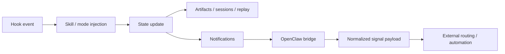

# oh-my-claudecode 개요

## 이 섹션의 역할

이 문서는 네 가지를 기록한다.

1. 원본 저장소가 지금 어떤 프로젝트인지
2. 이번 guide가 어떤 upstream evidence를 봤는지
3. 기존 guide가 왜 약해 보였는지
4. 이번 개정에서 무엇을 고쳤는지

---

## 원본 저장소 역할

- repo: `oh-my-claudecode`
- source: `https://github.com/Yeachan-Heo/oh-my-claudecode.git`
- synced commit basis: `fae376508355fb03ea6a2477453f37f0a59e707f`
- npm package: `oh-my-claude-sisyphus@4.9.3`

### 한 줄 요약

**Claude Code 위에 Team orchestration, persistent execution, tmux CLI workers, hooks, HUD, notifications, OpenClaw routing, benchmark/evaluation surface를 얹는 운영 런타임 repo**

---

## 왜 기존 guide가 허전해 보였나

기존 개정본은 방향이 완전히 틀린 건 아니었지만, 원본 repo의 폭을 충분히 반영하지 못했다.

### 부족했던 지점

1. **frontdoor가 너무 빨리 해석으로 들어갔다**
   - Team / OpenClaw / hooks 해석은 있었지만
   - repo의 전체 체격(`docs`, `src`, `benchmarks`, `missions`, `examples`)이 초반에 잘 안 보였다.

2. **drift 포인트를 더 세게 못 박았어야 했다**
   - `README.md`: `32 specialized agents`
   - `docs/ARCHITECTURE.md`: `19 specialized agents`
   - `docs/ARCHITECTURE.md`: `31 skills total`
   - `docs/MIGRATION.md`: `37 core skills`

3. **독자 유형별 reading path가 덜 분기됐다**
   - 사용자 / 운영자 / 통합 담당자 / 기여자 관점이 더 분리돼야 했다.

4. **Obsidian live target 처리 절차가 안전하지 않았다**
   - repo-local pack 작성과 live vault sync를 분리하지 않았고
   - default-like 경로를 목적지로 오판했다.

즉 문제는 문장력이 아니라 **작업 기준선**이었다.

---

## 실제로 확인한 upstream evidence

### 1. README

여기서 확인한 핵심:
- Quick Start 흐름
- Team canonical surface
- `omc team` CLI-first runtime
- `/ccg`, `omc ask`, OpenClaw integration
- package naming 차이
- README 기준의 current marketing/frontdoor 문구

### 2. `docs/MIGRATION.md`

여기서 확인한 핵심:
- Team MCP runtime deprecation
- `omc team` CLI-only 방향 강화
- skill consolidation / rename history
- 과거→현재 surface 이동

### 3. `docs/ARCHITECTURE.md`

여기서 확인한 핵심:
- hooks / skills / agents / state의 4축 설명
- agent lanes와 role boundaries
- skill layering model
- OMC를 orchestration architecture로 보는 틀

### 4. `docs/OPENCLAW-ROUTING.md`

여기서 확인한 핵심:
- normalized `signal` contract
- routeKey / priority 중심 라우팅
- OpenClaw gateway payload shape

### 5. `package.json`

여기서 확인한 핵심:
- version `4.9.3`
- published package name `oh-my-claude-sisyphus`
- `bin` entries: `oh-my-claudecode`, `omc`, `omc-cli`
- `files` 목록을 통해 실제 배포 surface 확인

### 6. 실제 디렉터리 구조

직접 확인한 핵심 폴더:
- `agents/`
- `skills/`
- `bridge/`
- `docs/`
- `src/team/`
- `src/hooks/`
- `src/openclaw/`
- `src/notifications/`
- `src/hud/`
- `benchmarks/`, `benchmark/`
- `missions/`
- `examples/`

이 구조 때문에 OMC는 “설치 후 명령 몇 개 배우는 툴”보다 **운영 시스템 repo**로 읽는 편이 정확하다.

---

## 이번 개정에서 고친 것

### 1. README frontdoor를 다시 세움

이번에는 초반부터 아래를 보이게 했다.
- repo 전체 체격
- current 핵심 표면
- drift 포인트
- reader type별 reading path
- benchmark/mission/observability까지 포함한 repo 성격

### 2. upstream drift를 frontdoor 수준으로 끌어올림

숨기지 않고, 학습자 혼동 포인트로 전면 배치했다.

### 3. Obsidian 출력 상태를 안전하게 분리함

현재 기준:
- repo-local note pack만 정본으로 유지
- live vault sync는 **보류**
- 이유: intended vault target 미확인

### 4. 재발방지 규칙을 guide-crafter 표준에 반영함

핵심 규칙은 이것이다.

> **default 값은 목적지가 아니다. live system write는 명시 확인 전 금지.**

---

## 학습자가 먼저 알아야 할 사실

### 1. Team이 중심이다
현재 OMC를 배울 때는 Team을 중심축으로 잡아야 한다.

### 2. `omc team`은 운영 레이어다
CLI worker runtime을 읽지 않으면 최신 OMC의 체감 구조를 놓친다.

### 3. OMC는 상태와 후처리를 가진 시스템이다
hooks, replay, artifacts, notifications가 이를 증명한다.

### 4. OpenClaw는 부록이 아니다
문서/소스/테스트가 분리되어 있는 공식 통합 레이어다.

### 5. benchmark / mission / observability 축도 repo 정체의 일부다
가이드에서 이 축을 빼면 원본보다 작게 보이게 된다.

---

## 다음 액션

이 overview를 읽고 나면 보통 다음 둘 중 하나로 가면 된다.

- 학습 순서가 필요하면 → `../01-learning-paths.md`
- 용어부터 헷갈리면 → `../02-glossary.md`

그리고 그다음에 원본 README + docs + src로 내려가면 된다.
